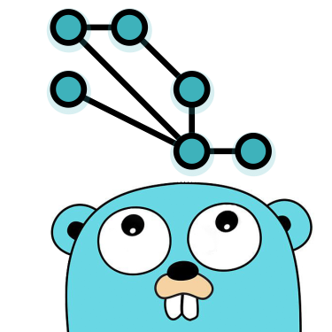

<div align="center">
  
  <h3>netDep</h3>
  <p><b>netDep</b> is a command-line, cross-platform static code analysis tool <br>for detecting inter-service network dependencies in microservices written in Go.</p>
</div>

---

## Features

- Detection of HTTP network dependencies, including [NATS Technology](https://nats.io/) and
  the [Gin Framework](https://gin-gonic.com/)
- Linting capabilities: detection of unused services
- Interprets URLs of endpoints, client calls, provided that the URL complies with one of the following conditions:
  - it is a string literal
  - it is created using concatenation on string literals
- Supports user-assisted detection of netDeps - supports such annotations as `//netDep: endpoint`
- Substitution of Environment variables
- Easy to use command line interface
- Color-coded output, outputting to file or console

## Installation

Clone the project and install using

```bash
  git clone ...
  go get -u ./...
```

**Important: For the tool to work, the project directory it is run against _has_ to compile and must have all its
dependencies installed.**
Use `go get` to synchronize your project's dependencies.

## Usage

### Option 1: Run the source code directly

To initiate dependency scanning depScan command has to be used in a command-line interface.
ou can run the tool using the default settings using:

```sh
go run main.go
```

or if you want more control, you can use the options as defined below. For example:

```sh
go run main.go -p "/some/project/dir" -s "/some/project/dir/svc"
```

### Option 2: Build and then run

1. Build an executable:

```sh
go build
```

2. The above command will generate a standalone binary, which can be run as follows:

On *NIX systems (linux distros, macOS, ...):

```sh
./netDep [-p project_directory] [-s service_directory] [-v]
```

On Windows:

```sh
./netDep.exe [-p project_directory] [-s service_directory] [-v]
```

### Annotations

The tool supports code annotations. This is necessary, because it might fail to resolve some of the variables due to
complexity of the code or lack of support.

#### Annotation format

User can add annotations as comments in their project before running the tool on it. Currently, the tool supports 3
types of annotations:

1) Annotations for client calls. Example:

```go
//netdep:client url=http://example.com/ targetSvc=service-2
c.Do(req)
```

Both `url` and `targetSvc` can be specified, but any one is also enough.

2) Annotations for endpoint definitions. Example:

```go
//netdep:endpoint url=http://example.com/ping
r.GET("/ping", func (c *gin.Context) {
c.JSON(200, gin.H{
"message": "pong",
})
})
```

3) Annotations for host name definition. Example:

```go
http.Handle("/count", th)
http.ListenAndServe(":8080", nil)
//netdep:host http://basic_handle:8080
```

#### Annotation suggestions

An annotation suggestion will be printed for all unresolved targets.

Suggestion output example:

```sh
service-1\main.go:24 couldn't be resolved. Add an annotation above it in the format "//netdep:client ..." or "//netdep:endpoint ..."
```

### Servicecalls extension

netDep is able to detect dependencies in projects which use the `servicecalls` package to abstract away internal network
communication
between services.

#### Servicecalls structure

The tool expects the user to provide a path to the `servicecalls` package directory via the `servicecalls-directory`
flag. The directory should contain `.go` files in the format
of `{servicename}-service.go`, where the servicename is an actual name of the service. The abstract communication
methods of each service should be defined in interface structures of these files,
as that's what the tool scans for.

### NATS Extension

netDep supports NATS messaging system. NATS analyzer is based on method name patterns
and specific way of passing Subjects.

#### Producer parsing

Source of the dependency is identified by the call to a method containing "NotifyMsg". Subject is
an argument whose selector has "Subject" substring. The parsing of the subject is position agnostic.

```go
nats.SomeNotifyMsg(..., natsConfig.XSubject, ...)
```

#### Consumer parsing

Target of the dependency is identified by the call to the method name containing "Subscribe". Subject is
an argument whose selector has "Subject" substring. The parsing of the subject is position agnostic.

```go
nats.Subscribe(..., natsConfig.XSubject, ...)
```

The patterns for method names can be modified under natsanalyzer#findDependencies. The pattern for subject
can be modified under natsanalyzer#findSubject.

### Verbs

When no verbs are specified (i.e. running just `netDep` with or without flags), the main logic is run.

Available verbs:

| Verb         | Description                                                                |
|:-------------|:---------------------------------------------------------------------------|
| `help`       | Displays the help page                                                     |
| `genManPage` | Generates manpage entries to the current directory, normally ./netDep.1    |
| `completion` | Creates command-line interface completion scripts in the current directory |

### Flags

| Argument                       | Description                                                                                                   | Default  |
|:-------------------------------|:--------------------------------------------------------------------------------------------------------------|:---------|
| `-h, --help`                   | Print help                                                                                                    |          |
| `-p, --project-directory`      | The path to the project directory. Must be a valid path.                                                      | `./`     |
| `-s, --service-directory`      | The path to the services inside the project. Must be a valid path.                                            | `./svc/` |
| `-e, --environment-variables`  | The path to the file containing environment variables. Must be a valid path. The file must be in YAML format. | ``       |
| `-o, --output-filename`        | Output filename such as ./deps.json. By default or when empty, it is outputted to stdout.                     | ``       |
| `-v, --verbose`                | Toggle printing stack traces of unknown variables.                                                            | `false`  |
| `-c, --servicecalls-directory` | The path to the servicecalls package directory. Must be a valid path.                                         | ``       |
| `-n, --no-color`               | Disable colorful terminal output.                                                                             | `false`  |
| `-S, --shallow`                | Toggle shallow scanning.                                                                                      | `false`  |
| `--dot`                        | Toggle graph output in dot format.                                                                            | `false`  |

## Color-coded output

netDep uses the [fatih/colo](https://pkg.go.dev/github.com/fatih/color) library to support colorful output to the
console.

Unless the `--no-color` flag is passed, the following color scheme is used:

| Color  | Description                                       |
|:-------|:--------------------------------------------------|
| Green  | Success                                           |
| Yellow | Warning                                           |
| Red    | Error                                             |
| Cyan   | Action for the user (suggestion i.e. to annotate) |

## Visualisation

netDep can output the dependency graph in the [dot format](https://en.wikipedia.org/wiki/DOT_(graph_description_language)). This output can then be
copied into a `.dot` extension file and used to generate a visualisation of the graph by a tool such as [Graphviz](https://graphviz.org/).

Various options can be provided when generating the graph with Graphviz, but a relatively simple command that has worked quite well is:

```sh
dot -Tsvg graph.dot > graph.svg
```

## Documentation

Additional documentation can be found in the Final Report of the Software Project course.

Moreover, there are in-line comments in every gofile to ease extendability or refactoring of the project.

## Roadmap

- Grafana
  integration (https://gitlab.ewi.tudelft.nl/cse2000-software-project/2021-2022-q4/cluster-13/microservice-architecture-analysis-tool/code/-/issues/78)
- The ability for netDep to decide whether a dependency relies on external
  services (https://gitlab.ewi.tudelft.nl/cse2000-software-project/2021-2022-q4/cluster-13/microservice-architecture-analysis-tool/code/-/issues/27)
- More extensive support for interpreting
  URLs (https://gitlab.ewi.tudelft.nl/cse2000-software-project/2021-2022-q4/cluster-13/microservice-architecture-analysis-tool/code/-/issues/77)

## Contributing

### Issues

When encountering a bug or otherwise unexpected behaviour, please open an issue and fill in the default issue template.
Please, label the issue appropriately. A member of the team will assign a weight and an estimated time needed.
The issue will then be scheduled to be addressed by the developers (triaging).

Anyone can contribute by opening a merge request to address any issue. It is strongly encouraged to use a Merge Request
template.

See `CONTRIBUTING.md` for an in-depth explanation.

Please adhere to this project's `code of conduct`.

## Authors

TU Delft CSE2000 Software Project Team, for Weave B.V:

- Gints Kuļikovskis
- Martynas Krupskis
- Bianca Şerbănescu
- Lukas Ostrovskis
- Delano Flipse

## License

[//]: # (If this repository is to be open-sourced, please update the below statement to link to the new licence.)

[//]: # (And do not forget to upload the appropriate licence to the following file: /LICENCE.)
All rights reserved, Weave B.V.
